# Prensa antigua

Biblioteca Virtual de Prensa Histórica (Ministerio de Cultura), *El Guadalete: periódico político y literario*, Jerez de la Frontera, publicación 3633. Prensa de dominio público; se ruega citar la fuente.

### El Guadalete, 13 de abril de 1890: esquela de Luciano Becerra y Govantes (calle Pedro Alonso 17, parroquia de San Miguel)

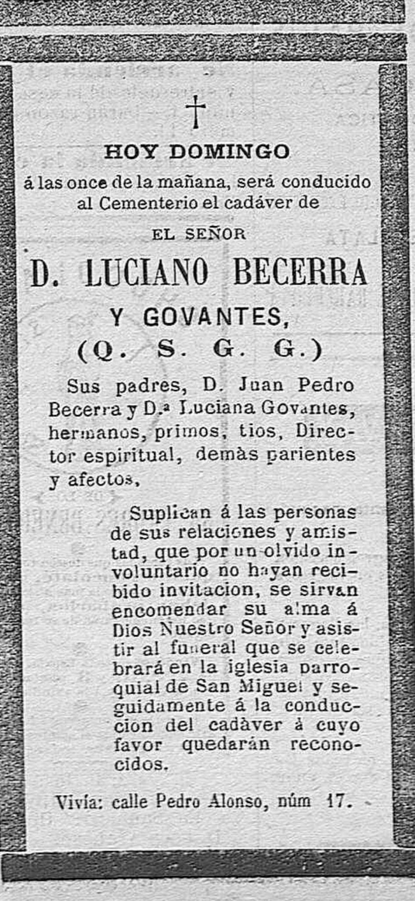

Fuente [30](../../fuentes/030.md)

### El Guadalete, núm. 13873, 8 de octubre de 1900, p. 2: muerte de D.ª Luciana Govantes y González de Saravia

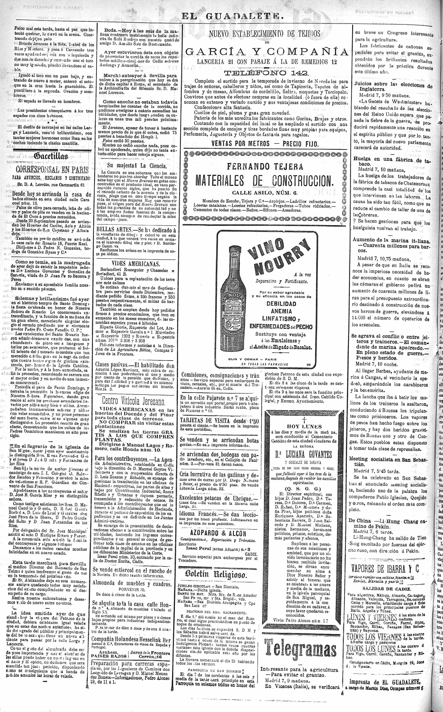

Fuente [98](../../fuentes/098.md)

### El Guadalete, núm. 13874, 9 de octubre de 1900, p. 2: entierro de D.ª Luciana Govantes

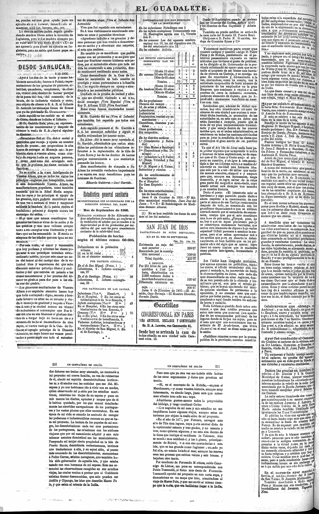

Fuente [98](../../fuentes/098.md)

### El Guadalete, núm. 11320, 21 de febrero de 1893, p. 2: entierro del notario Juan Pedro Becerra y Pérez

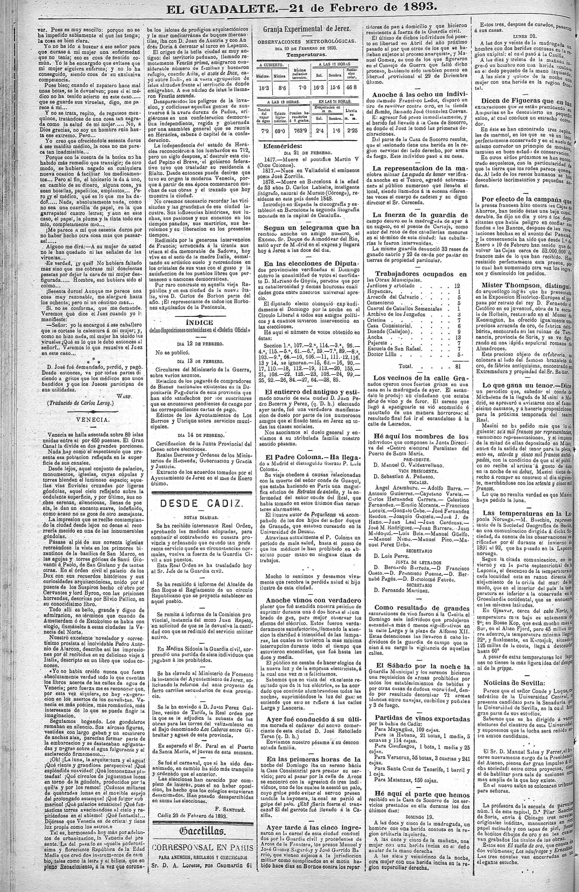

### El Guadalete, núm. 11320, 21 de febrero de 1893, p. 3: Registro Civil, defunción del notario

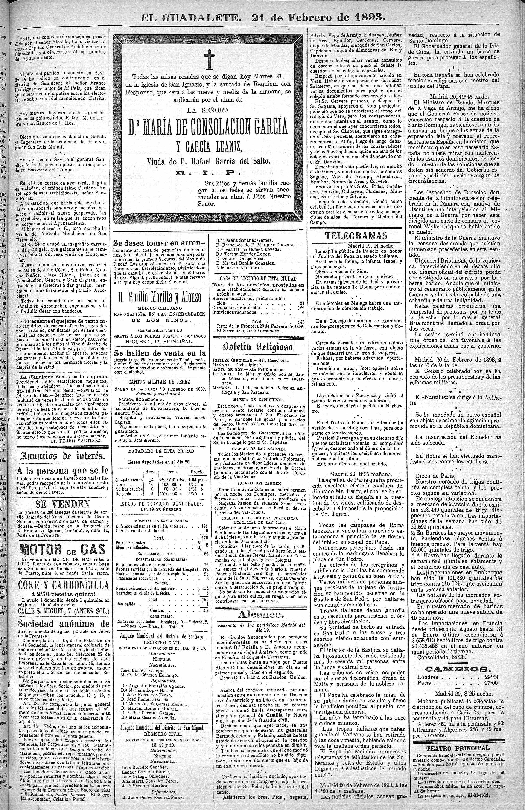

### El Guadalete, núm. 13383, 3 de junio de 1899, p. 2: esponsales de Rafael Becerra y Govantes con Sebastiana Barrera y Arias

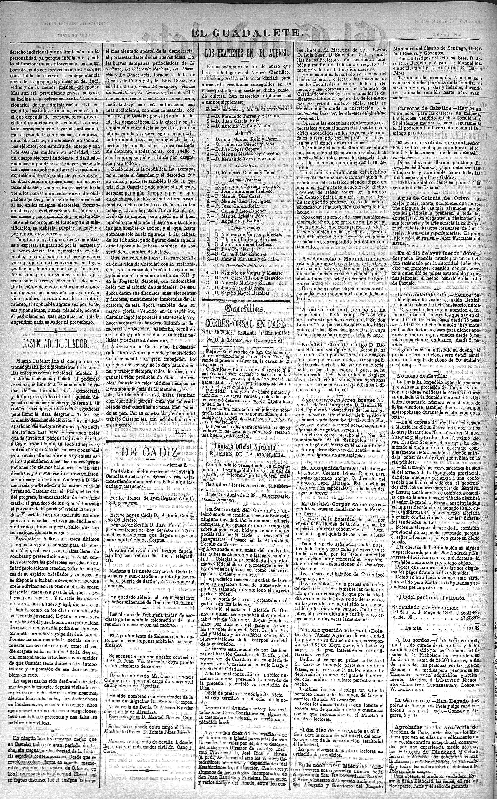

### El Guadalete, núm. 14261, 13 de noviembre de 1901, p. 3: nacimiento de Luciana Becerra Barrera

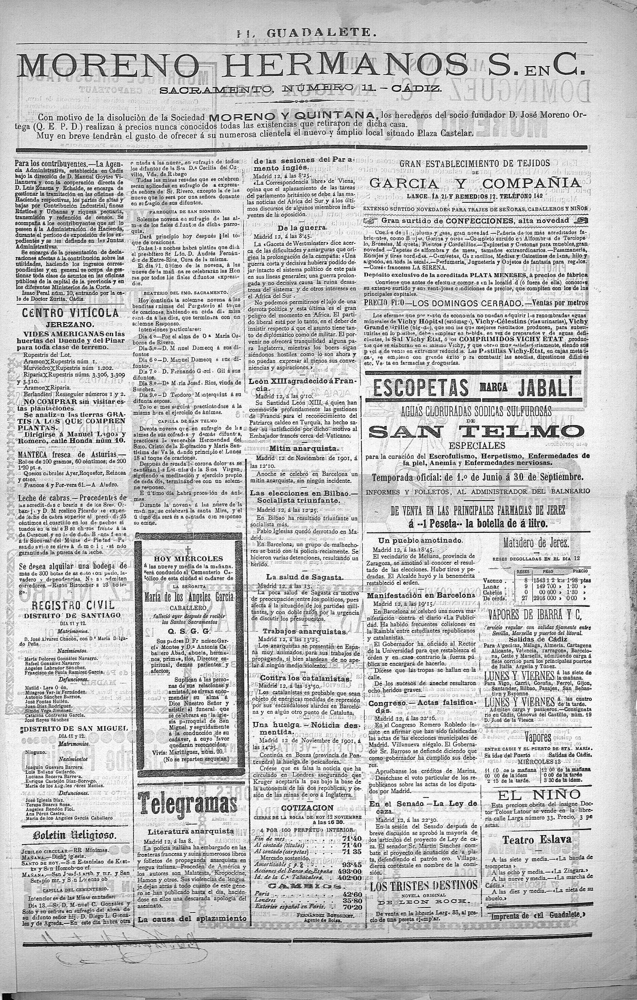

### El Guadalete, núm. 14305, 27 de diciembre de 1901, p. 2

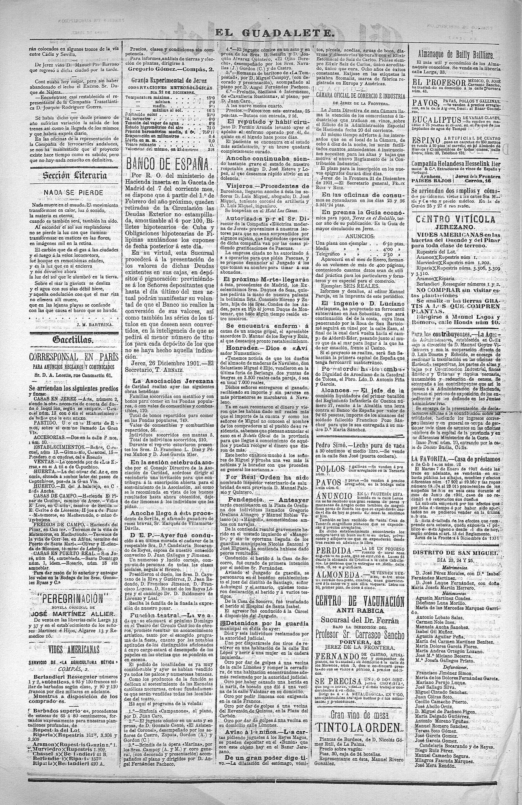

### El Guadalete, núm. 14839, 25 de julio de 1903, p. 3: nacimiento de las mellizas Becerra Barrera

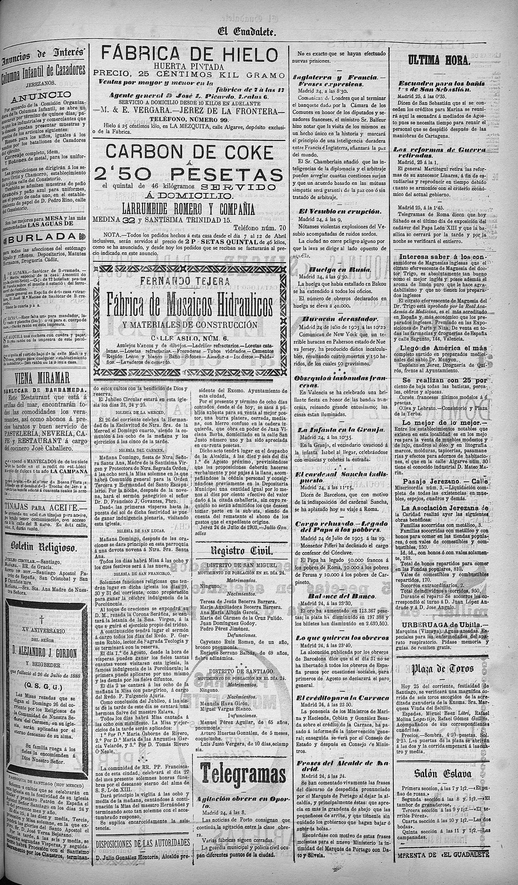

### El Guadalete, núm. 14841, 28 de julio de 1903, p. 3: bautizo de las mellizas

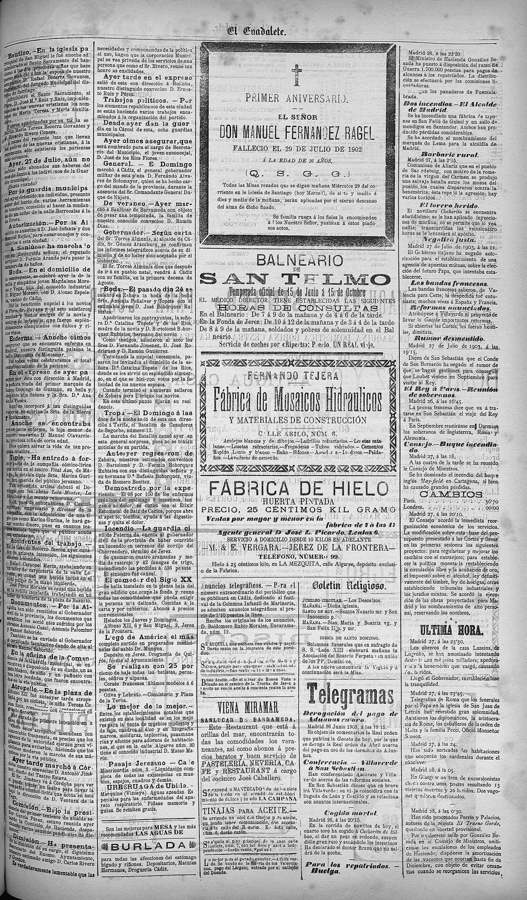

### El Guadalete, núm. 14865, 25 de agosto de 1903, p. 3: Registro Civil y gacetillas

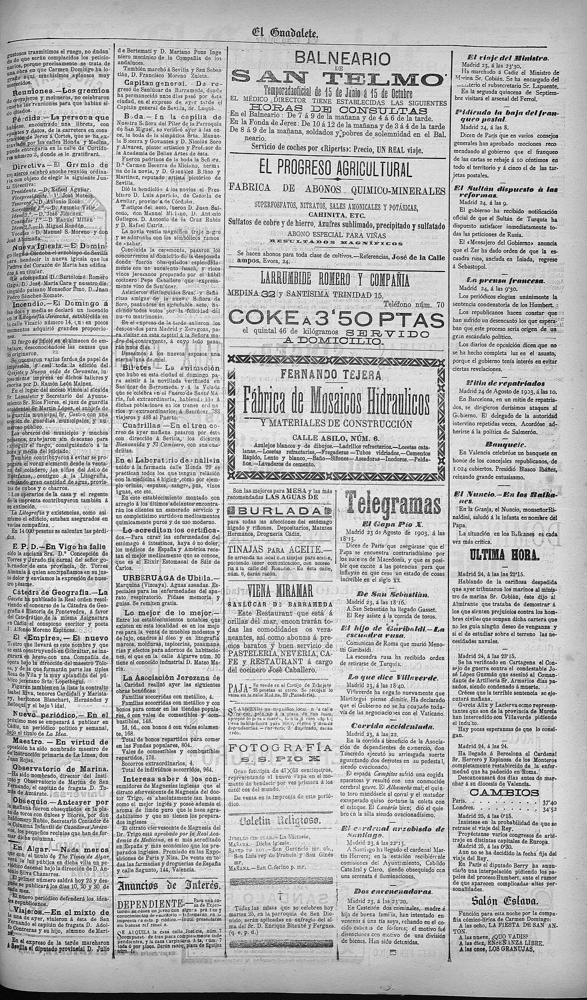

### El Guadalete, núm. 14866, 26 de agosto de 1903, p. 4: Registro Civil y gacetillas

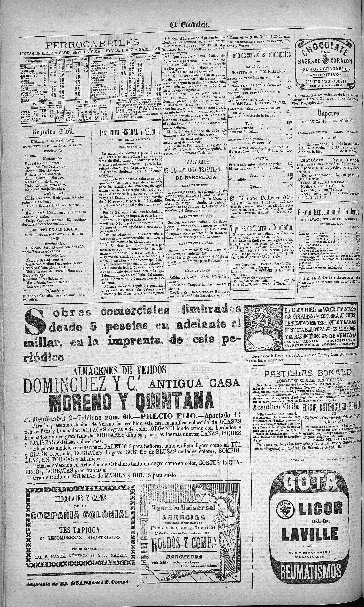

### El Guadalete, núm. 15134, 1 de julio de 1904, p. 4: boda de Teresa Becerra Govantes con Ricardo Rivero Conesa

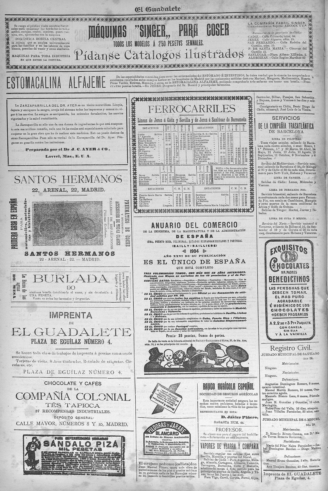

### El Guadalete, núm. 15443, 10 de mayo de 1905, p. 2: bautizo de Adelaida Miciano Becerra

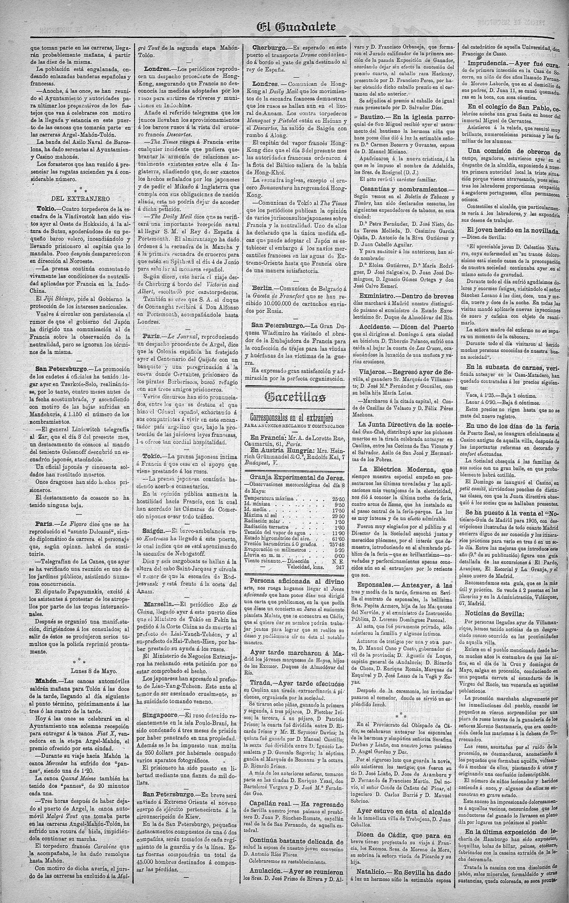

### El Guadalete, núm. 15446, 13 de mayo de 1905, p. 2: bautizo de María del Pilar Becerra Barrera

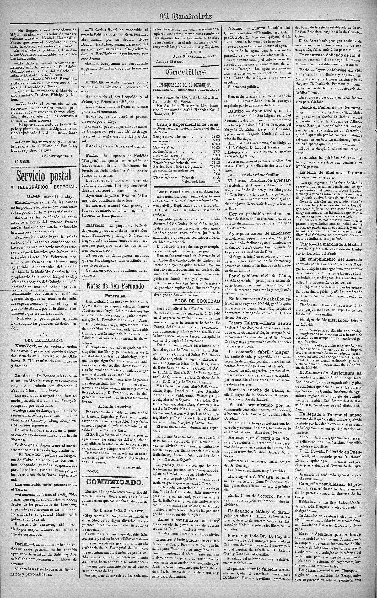

### El Guadalete, núm. 20934, 15 de junio de 1918, p. 1: el notario Juan Pedro Becerra, padre del secretario Rafael Becerra

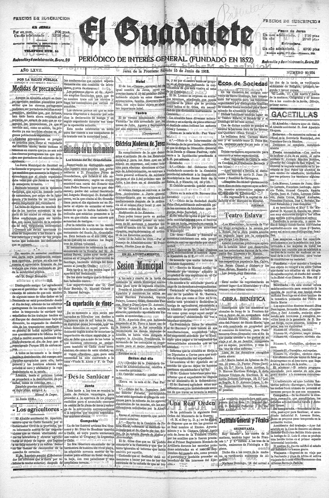

---
[Inicio](../../README.md)
